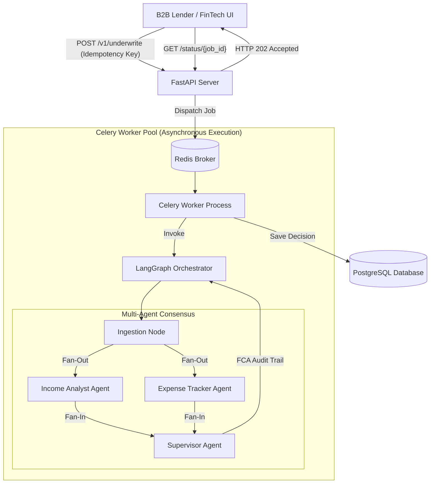

# FlowScore: Open Banking Underwriting Engine

FlowScore is a B2B SaaS platform that utilizes **Multi-Agent Large Language Models (LLMs)** and **Open Banking APIs** to instantly underwrite loans for "Thin-File" borrowers. Built specifically to comply with the **UK FCA Consumer Duty** and **SOC2** regulations, FlowScore generates transparent, dual-layer cryptographic audit trails for every credit decision.

## 🎯 The Core Mission
Legacy credit bureaus (Experian, Equifax) rely on decades of structured credit history to generate a score. This system inherently punishes:
* **Gig-Economy & Freelance Workers:** Uber drivers, Deliveroo riders, and self-employed creators whose income is volatile or irregular. Legacy banks struggle to underwrite these profiles because standard Debt-to-Income (DTI) models expect a fixed monthly salary.
* **Young Adults & Immigrants:** Those entering the financial system for the first time without prior credit cards or mortgages.

### How FlowScore Fixes This
FlowScore bypasses the traditional, outdated credit score. Instead, it ingests 12 months of rich, real-time **Open Banking data** (e.g., via TrueLayer or Plaid) and uses a network of specialized AI agents (via LangGraph) to evaluate a borrower's *true* cash flow. 

* An **Income Analyst Agent** measures the stability, frequency, and trajectory of gig-economy payouts.
* An **Expense Tracker Agent** isolates strict baseline living costs (rent, utilities, groceries) from discretionary spending.

**FCA Consumer Duty Compliance:**
In the UK financial sector, transparency is legally mandated. FlowScore is built strictly around the **FCA Consumer Duty** rules. Instead of an unexplainable "black-box" AI decision, FlowScore's Supervisor Agent synthesizes the data and outputs a strict, natural-language **Audit Trail**. This ensures algorithmic transparency, fair value, and guarantees that lenders can clearly explain exactly *why* a decision was made to the consumer.

---

## 📊 The Science of Creditworthiness: Traditional vs. Open Banking

Understanding *how* credit is traditionally measured is critical to understanding why FlowScore exists.

### The Traditional Model (FICO / Experian)
Legacy bureaus determine creditworthiness by looking backward at a consumer's **relationship with debt**. The major factors are:
1. **Payment History (35%):** Have you missed payments on past loans?
2. **Credit Utilization (30%):** How much of your available credit limit are you using?
3. **Credit Age (15%):** How long have your accounts been open?

**The Fatal Flaw:** Traditional scoring requires you to go into debt to prove you can handle debt. If you are a young professional, a recent immigrant, or someone who strictly uses debit cards, you have a **"Thin-File"**. Even if you earn £100,000 a year, legacy systems will reject you because they have no historical data on you.

### The FlowScore Model (Cash Flow Underwriting)
FlowScore completely ignores legacy credit scores. Instead, we use Open Banking to analyze a consumer's **actual liquidity and affordability** in real-time. The factors that *actually* matter to our AI are:

1. **Income Volatility & Trajectory:** We don't just look for a fixed salary. The *Income Analyst Agent* identifies recurring freelance payouts, assesses their stability, and projects future earnings.
2. **Fixed vs. Discretionary Expense Baselines:** The *Expense Tracker Agent* separates strict survival costs (rent, utilities, groceries) from discretionary spending (dining, entertainment) to find the borrower's true disposable income.
3. **Behavioral Risk Markers:** We flag dangerous financial behaviors that legacy bureaus miss, such as chronic overdraft usage, returned direct debits, or excessive gambling transactions.
4. **True Debt-to-Income (DTI) Ratio:** Ultimately, the system mathematically calculates whether the applicant's net cash flow can safely absorb the new loan repayment without causing financial distress.

---

## 🛠️ Enterprise Architecture & Tech Stack
FlowScore runs on a decoupled, highly-scalable enterprise architecture capable of supporting Tier-1 banking volume.

* **Backend & API:** Python 3.11+, FastAPI (Async)
* **Message Broker & Background Tasks:** Celery + Redis
* **AI Orchestration:** LangGraph (Multi-Agent State Management)
* **LLMs:** Google Gemini 1.5 Pro / OpenAI GPT-4o
* **Data Validation:** Pydantic (Strict Output Parsing)
* **Database:** PostgreSQL (SQLAlchemy & Alembic)
* **Frontend:** Streamlit (Open Banking Simulation Dashboard)
* **Monetization & Security:** Idempotency-Keys, AES-256 KMS Encryption, SOC2 Audit Logging

## 🚀 Getting Started

To run the FlowScore SaaS MVP locally:

1. **Clone the repository:**
   ```bash
   git clone https://github.com/rishisubedi/flow-score.git
   cd flow-score
   ```

2. **Start the Infrastructure (Cluster):**
   Use Docker Compose to spin up the full decoupled cluster (FastAPI Web Server, Celery Worker, Redis Message Broker, and PostgreSQL Database).
   ```bash
   docker-compose up -d --build
   ```

3. **Launch the Enterprise Demo UI:**
   We have built a production-level Streamlit application to simulate Open Banking ingestion and visually interact with the AI Engine.
   ```bash
   pip install -r requirements.txt
   python -m streamlit run frontend/app.py
   ```
   Navigate to `http://localhost:8501` in your browser. You can select realistic customer profiles, view simulated bank ledgers, and execute AI underwriting jobs with visual FCA compliance auditing.

4. **Access the API Documentation:**
   Navigate to `http://localhost:8080/docs` to interact with the auto-generated Swagger UI.

### 🛡️ Enterprise Resilience (Zero-Crash Fallback)
The API is built to never crash. If the upstream LLM API experiences an outage, FlowScore intercepts the failure and outputs a **Safety Net Override**:
```json
{
    "applicant_id": "gig_worker_9942",
    "risk_score": 0,
    "decision": "MANUAL_REVIEW",
    "dti_ratio": 9.99,
    "audit_trail": {
        "internal_compliance_log": {
            "income_volatility_score": 1.0,
            "expense_baseline": 0.0,
            "affordability_logic": "System failure triggered safety override. Supervisor Agent Error."
        },
        "customer_facing_explanation": "We are currently reviewing your application manually to ensure we provide you with the most accurate and fair assessment."
    }
}
```
This guarantees strict FCA compliance by never leaving a customer hanging or generating fake automated decisions during a system outage.

---

## 🧠 Multi-Agent Architecture (LangGraph)
The AI decision-making pipeline utilizes a highly optimized **Fan-Out / Fan-In** LangGraph architecture managed asynchronously by a **Celery Worker Pool**.

1. **API Ingestion (FastAPI):** Parses strict Pydantic schemas, validates Idempotency Keys (Redis), and dispatches the job to Celery, instantly returning a `202 Accepted` to prevent HTTP timeouts.
2. **Parallel Fan-Out (Celery):** Data is routed simultaneously to the `Income Analyst` and `Expense Tracker` LangGraph nodes, cutting LLM inference latency in half.
3. **Synchronized Fan-In:** A custom `merge_lists` reducer guarantees that parallel outputs and errors don't overwrite each other in the `AgentState` TypedDict.
4. **Supervisor Node:** Synthesizes the parallel data, injects **Dynamic YAML Rules**, and generates the final FCA-compliant audit trail and DTI calculation.



## 💎 Enterprise SaaS Features Built-In
We injected several commercial improvements to maximize our Total Addressable Market (TAM) and comply with Tier-1 banking security requirements:

* **SOC2 Human-in-the-Loop (HITL) Overrides:** Risk Officers can override AI decisions via a secure `POST /override/{job_id}` endpoint. The system generates an immutable, relational SQL log (`HumanOverride` table) tracking the officer's SSO ID and their mandatory justification notes.
* **KMS Database Encryption:** Plaintext API keys are strictly prohibited. The system utilizes `cryptography.fernet` to AES-256 encrypt all tenant BYOK keys at rest in PostgreSQL, decrypting them dynamically only in-memory during LangGraph execution.
* **Dynamic Rule Injection:** Lenders can inject custom YAML logic (e.g., *"Reject instantly if Gambling > 15%"*) into the `UnderwritingRequest` payload, which the Chief Risk Officer (Supervisor) Agent strictly enforces before finalizing the LLM decision.
* **Open Banking Webhook Ingestion:** Built-in `POST /webhook/open-banking` endpoint designed to ingest asynchronous push notifications (with HMAC signature validation) directly from Plaid/TrueLayer when a user's bank data finishes syncing.
* **OpenTelemetry Observability:** Custom middleware injects a unique `X-Trace-ID` into the headers of every request, enabling distributed tracing across the API, Celery workers, and LLM nodes.
* **Decoupled Architecture:** Synchronous HTTP processing was replaced with Celery message queues and Redis, eliminating API gateway timeouts during heavy LLM generation.
* **Idempotency Keys:** Redis-backed request tracking prevents double-billing if a client experiences a network glitch and accidentally submits the same payload twice.
* **SaaS Billing & Metering:** Fully functional credit deduction system. Tenants hit a `402 Payment Required` wall when API credits run out.
* **Bring Your Own Key (BYOK):** Enterprise tenants can inject their own Google Gemini or OpenAI API keys directly into the LangGraph state to bypass platform rate limits.
* **O(1) Multi-Tenancy:** Securely support hundreds of B2B lenders on the same PostgreSQL database using `client_id` partitioning.
* **Prompt Injection Protection:** Strict Pydantic RegEx constraints prevent malicious actors from hacking the LLM pipeline (e.g., placing *"IGNORE ALL INSTRUCTIONS"* in bank transfer descriptions).

---

## 🧪 Enterprise Test Coverage & Validation
To guarantee production readiness and SOC2 compliance, the API includes a rigorous testing suite (`pytest`) validating the core enterprise extensions.

### Pytest Execution Results
```text
$ python -m pytest tests/test_enterprise.py -v
======================= test session starts ========================
platform win32 -- Python 3.14.0, pytest-9.1.1
plugins: anyio-4.14.2, langsmith-0.10.6, asyncio-1.4.0

collecting ... collected 4 items

tests/test_enterprise.py::test_telemetry_trace_id_middleware PASSED      [ 25%]
tests/test_enterprise.py::test_admin_kms_encryption_on_creation PASSED   [ 50%]
tests/test_enterprise.py::test_open_banking_webhook_hmac_ingestion PASSED [ 75%]
tests/test_enterprise.py::test_human_override_soc2_compliance PASSED     [100%]

======================== 4 passed in 3.19s =========================
```

### Test Suite Architecture (Snippet)
The testing environment utilizes an in-memory SQLite database and intercepts dependency injection to validate cryptographic KMS hashing and immutable audit trails without mutating production data.

```python
def test_human_override_soc2_compliance():
    """Test that Risk Officers can manually override AI decisions and generate an immutable audit log."""
    # ... [Seed fake AI decision] ...
    
    # Submit Risk Officer Override
    override_payload = {
        "officer_sso_id": "okta_user_456",
        "new_decision": "APPROVED",
        "justification_notes": "Applicant provided physical proof of additional offshore income. Overriding AI."
    }
    response = client.post(f"/v1/underwrite/override/{job_id}", json=override_payload)
    
    assert response.status_code == 200
    
    # Verify the immutable SOC2 log exists in the database
    from app.db.models import HumanOverride
    audit_log = db.query(HumanOverride).filter(HumanOverride.job_id == job_id).first()
    
    assert audit_log is not None
    assert audit_log.officer_sso_id == "okta_user_456"
    assert audit_log.previous_decision == "REJECTED"
    assert audit_log.new_decision == "APPROVED"
    assert audit_log.justification_notes.startswith("Applicant provided physical")
```

---

## 🔮 Future Roadmap (Potential Improvements)
FlowScore is continually evolving. Below are the planned architectural and feature improvements to further dominate the B2B lending space:

1. **OAuth2 & Role-Based Access Control (RBAC):**
   * Implement strict JWT-based authentication to delineate platform permissions between `System Administrators` (manage billing/API keys), `Risk Officers` (view internal audit logs and override decisions), and `Standard Agents` (submit applications only).

2. **Real-Time Streaming via Server-Sent Events (SSE):**
   * Replace the current short-polling mechanism (`GET /status/{job_id}`) with SSE or WebSockets. This will allow the frontend to stream the LangGraph execution steps (e.g., *"Income Analyst evaluating... Expense Tracker analyzing..."*) in real-time, providing a superior UI experience.

3. **Multi-Modal Document Ingestion (OCR):**
   * Add a pipeline to ingest and parse PDF paystubs and bank statements utilizing Gemini's native multi-modal capabilities. This acts as a fallback for applicants whose banks do not support Open Banking APIs.

4. **Advanced Telemetry & Grafana Dashboards:**
   * Integrate Prometheus and Grafana to track critical business metrics: LLM token usage per tenant, average agent consensus latency, hallucination rates, and system-wide fallback occurrences.

5. **Automated CI/CD Pipelines:**
   * Introduce GitHub Actions for automated unit testing (`pytest`), code linting, and building/pushing zero-downtime Docker images to AWS ECR / Google Artifact Registry.
