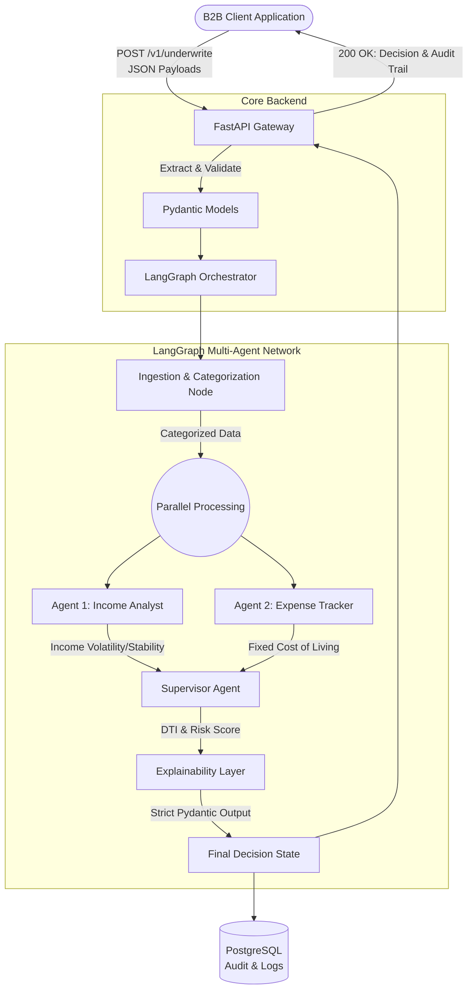

# FlowScore API: Technical Specification Document

> [!IMPORTANT]
> This document outlines the MVP architecture for **FlowScore API**, a "Thin-File" Open Banking Credit Underwriter designed for gig-economy workers and immigrants, strictly complying with UK FCA Consumer Duty regulations.

## 1. Architecture Diagram

The system employs a multi-agent consensus network managed by LangGraph. It processes transactions in parallel streams for income and expenses before a Supervisor agent synthesizes the final FCA-compliant decision.



---

## 2. Repository Structure

A production-ready FastAPI scaffold for the MVP, separating concerns between API routing, agent orchestration, database interactions, and business logic.

```text
flowscore-api/
├── app/
│   ├── api/
│   │   ├── __init__.py
│   │   ├── dependencies.py      # Auth and DB session dependencies
│   │   └── v1/
│   │       ├── endpoints/
│   │       │   ├── health.py
│   │       │   └── underwrite.py # Core endpoint
│   │       └── router.py
│   ├── core/
│   │   ├── config.py            # Pydantic BaseSettings (GCP, OpenAI keys)
│   │   └── security.py          # API key validation
│   ├── db/
│   │   ├── database.py          # SQLAlchemy engine & session
│   │   └── models.py            # PostgreSQL ORM models
│   ├── models/
│   │   ├── __init__.py
│   │   └── schemas.py           # Pydantic Input/Output models
│   ├── agents/
│   │   ├── __init__.py
│   │   ├── graph.py             # LangGraph state graph compilation
│   │   ├── state.py             # TypedDict for agent state
│   │   └── nodes/               # Individual agent implementations
│   │       ├── ingestion.py
│   │       ├── income.py
│   │       ├── expense.py
│   │       └── supervisor.py
│   └── main.py                  # FastAPI application entry point
├── tests/
│   ├── conftest.py
│   ├── test_api.py
│   └── test_agents.py
├── data/
│   └── mock_transactions.json   # TrueLayer/Plaid simulated data
├── .env.example
├── docker-compose.yml           # Local dev with Postgres
├── Dockerfile                   # Cloud Run optimized image
├── requirements.txt
└── README.md
```

---

## 3. Data Models (Pydantic)

Strict parsing is handled by Pydantic. These models enforce structure at the API boundary and ensure the LLMs return strictly typed explanations.

```python
from pydantic import BaseModel, Field
from typing import List, Optional, Literal
from datetime import datetime
from typing_extensions import TypedDict

# --- 1. Transaction Input ---
class Transaction(BaseModel):
    transaction_id: str
    date: datetime
    amount: float = Field(..., description="Amount in GBP. Positive for income, negative for expense.")
    description: str
    category: Optional[str] = None

class UnderwritingRequest(BaseModel):
    applicant_id: str
    transactions: List[Transaction] = Field(..., min_length=1)

# --- 2. LangGraph State ---
class AgentState(TypedDict):
    applicant_id: str
    transactions: List[Transaction]
    categorized_transactions: List[Transaction]
    income_metrics: dict      # Generated by Income Analyst
    expense_metrics: dict     # Generated by Expense Tracker
    final_decision: Optional["CreditDecisionOutput"]
    errors: List[str]

# --- 3. Final Decision Output (FCA Compliant) ---
class FCAAuditTrail(BaseModel):
    income_assessment: str = Field(..., description="Natural language explanation of income stability and volatility.")
    expense_assessment: str = Field(..., description="Natural language explanation of baseline living costs.")
    affordability_logic: str = Field(..., description="Explanation of DTI and affordability calculation.")
    consumer_duty_statement: str = Field(..., description="Statement confirming fair value and good consumer outcomes.")

class CreditDecisionOutput(BaseModel):
    applicant_id: str
    risk_score: int = Field(..., ge=0, le=1000, description="Risk score from 0 (highest risk) to 1000 (lowest risk).")
    decision: Literal["APPROVED", "REJECTED", "MANUAL_REVIEW"]
    dti_ratio: float = Field(..., description="Calculated Debt-to-Income ratio.")
    audit_trail: FCAAuditTrail
```

---

## 4. API Routing

The FastAPI application will expose the following essential endpoints:

| Method | Endpoint | Description |
| :--- | :--- | :--- |
| `POST` | `/v1/underwrite` | Submits the Open Banking JSON payload, triggers the LangGraph workflow synchronously, and returns the final `CreditDecisionOutput`. |
| `GET` | `/v1/decisions/{applicant_id}` | Retrieves a past underwriting decision and its FCA audit trail from the PostgreSQL database. |
| `GET` | `/health` | Liveness probe for GCP Cloud Run deployment. |

---

## 5. 10-Day Sprint Plan

An aggressive agile sprint focused on getting the MVP from zero to a demo-ready state.

### Phase 1: Infrastructure & Core Pipeline
- **Day 1: Scaffold & Environment.** Initialize GitHub repo, FastAPI structure, Dockerfile, docker-compose (PostgreSQL), and Pydantic models.
- **Day 2: API & Database layer.** Implement the API endpoints, SQLAlchemy ORM, and database connection. Set up mock Open Banking JSON payload ingestion.
- **Day 3: Ingestion Pipeline.** Build the data cleaning and categorization logic (either heuristic or via a fast LLM pass) to prep data for the agents.

### Phase 2: Multi-Agent Network (LangGraph)
- **Day 4: LangGraph Foundation.** Define the `AgentState` TypedDict and compile the basic state graph in `graph.py`.
- **Day 5: Income Analyst Agent.** Prompt engineer and implement Agent 1 using `gpt-4o`/`claude-3.5-sonnet`. Calculate volatility and frequency metrics.
- **Day 6: Expense Tracker Agent.** Prompt engineer and implement Agent 2. Isolate baseline non-discretionary expenses.
- **Day 7: Supervisor Agent & Explainability.** Implement the Supervisor. Use Pydantic's `with_structured_output` (or LangChain equivalent) to enforce the `CreditDecisionOutput` schema.

### Phase 3: Finalization & Launch
- **Day 8: Integration & Persistence.** Hook the completed LangGraph execution into the `/v1/underwrite` endpoint. Ensure the output is saved to PostgreSQL.
- **Day 9: Edge Cases & Testing.** Write Pytest cases using mock payloads (e.g., highly volatile gig income vs. stable immigrant remittances). Handle LLM hallucination fallbacks.
- **Day 10: Deployment & Demo Prep.** Deploy the Docker container to Google Cloud Run. Finalize README and prepare Postman/cURL collections for the demo.
